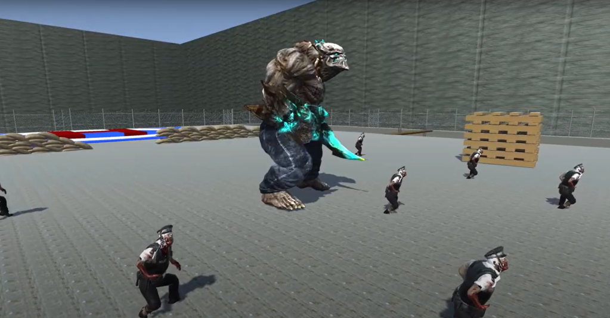

# Zomderbar: Retro-Inspired FPS

## Overview

Zomderbar is an action-packed, first-person shooter game developed in Unity3D. Set in a post-apocalyptic wasteland overrun with hordes of undead, players must fight their way through relentless zombies and formidable bosses to reach a rescue chopper at the heliport. With inspiration drawn from retro arcade shooting games, Zomderbar features vibrant colors and atmospheric details while avoiding pixel art.

## Key Features

- **Zombie Waves**: Fight through increasingly difficult waves of zombies.
- **Boss Fights**: Square off against tough boss enemies that require strategy to defeat.
- **Dynamic Sound Design**: Custom-created soundtrack and immersive sound engineering.
- **Retro Visuals**: Dive into environments that pay homage to retro arcade shooting games.
- **Weapon Arsenal**: Choose from a variety of weapons, each with its own characteristics.
- **Dynamic UI**: The game's UI responds to in-game events, enhancing the gameplay experience.

## Technologies Used

- Unity3D
- C#
- Audio Production
- Sound Engineering

## Screenshots

